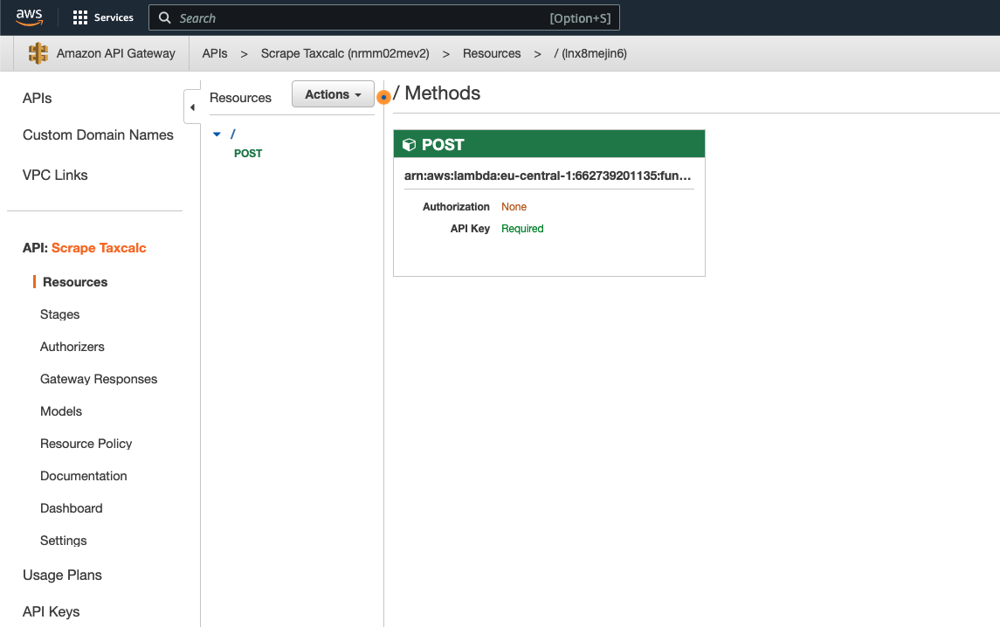
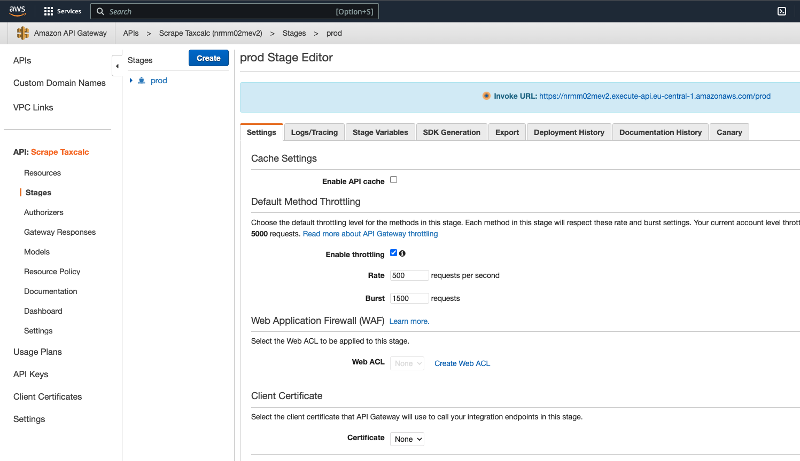
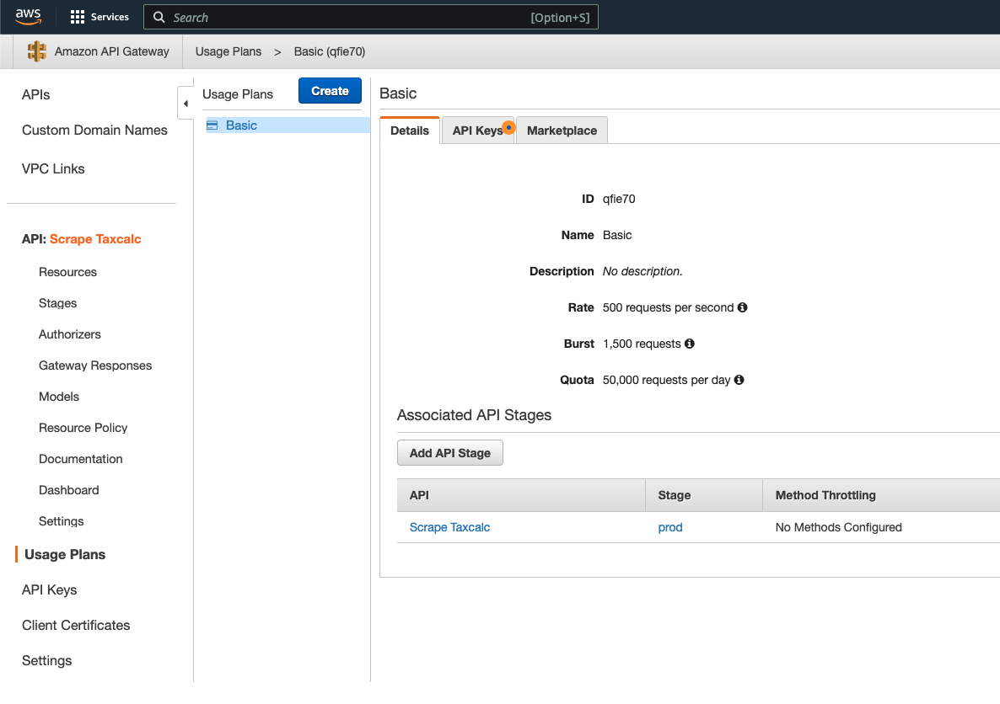
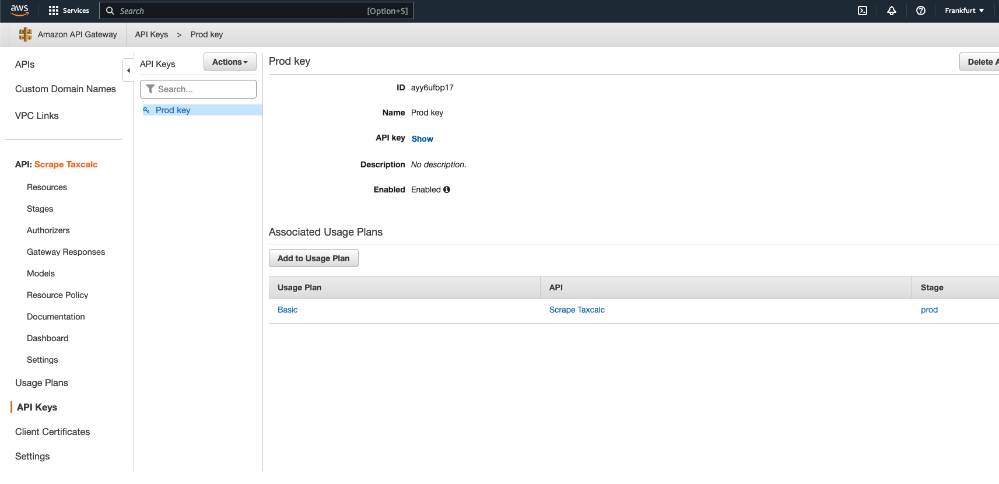
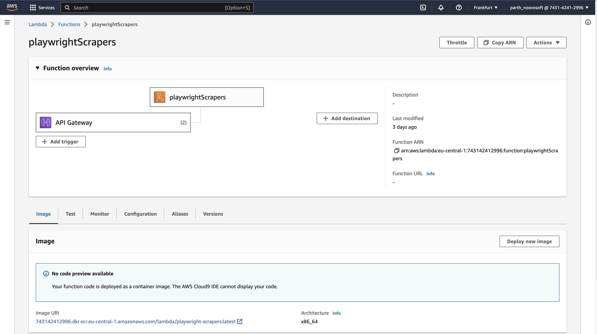
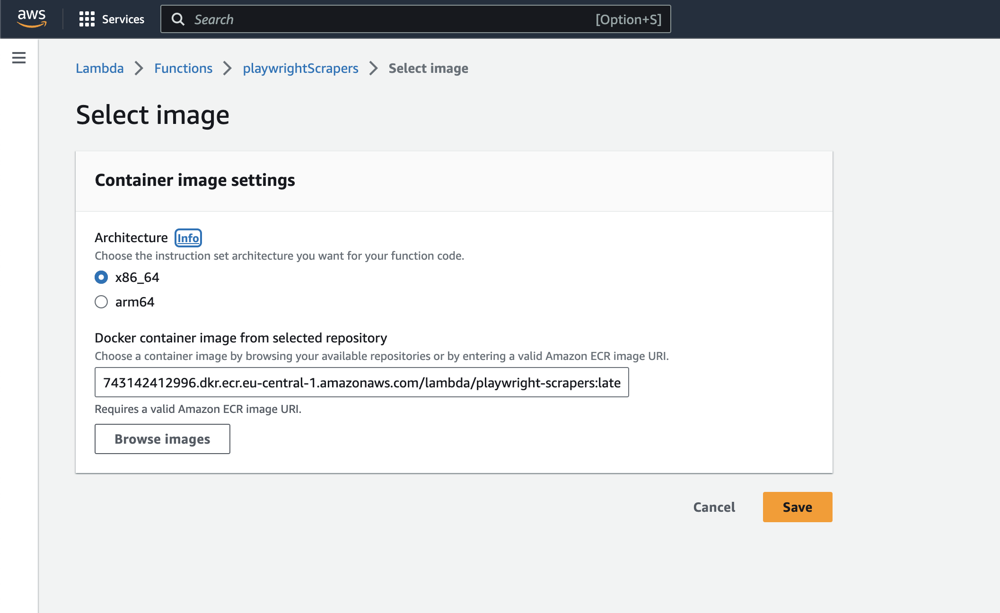

# Playwright scraper with AWS lambda and Api Gateway

This is a sample project that demonstrate how we can levarage serverless tool [aws Lambda](https://aws.amazon.com/lambda/) to run browser scrapers using [Playwright](https://playwright.dev/) using [Amazon API Gateway](https://aws.amazon.com/api-gateway/).

Prerequisites:
- Node:18
- Docker

## Run locally

```shell
# Install dependencies
npm install && npx playwright install-deps chromium

# Test scraper locally
npm run start
```

## One time setup on AWS

First, in the system where you have your project setup, [install](https://docs.aws.amazon.com/cli/latest/userguide/getting-started-install.html) AWS cli and configure the authentication with the aws user role by following steps on [this page](https://docs.aws.amazon.com/cli/latest/userguide/cli-authentication-short-term.html).

We will be user amazon's [Elastic Container Service (ECR)](https://docs.aws.amazon.com/AmazonECR/latest/userguide/what-is-ecr.html) to store our Docker images that later our lambda function will use to run our scrapers.
Ths aws user role you used to configure the AWS cli should have access to get the authentication token and push to the ECR. Add permissions mentioned on [this page](https://docs.aws.amazon.com/AmazonECR/latest/userguide/image-push.html) to your user.

Try to login to the ECR from your system

Create new container repository by following [these stepts](https://docs.aws.amazon.com/AmazonECR/latest/userguide/repository-create.html) from the official documentation. In this example, we created repository with name `lambda/playwright-scrapers`

Let's verify the commmunication with ECR. Follow below commands to build docker image and push to the registry.
Replace <aws_acc_id>, <region> and ECR repository name based on your setup.


```shell

# Build image
docker build -t pw-scraper-with-lambda .

# Tag and Push image
docker tag tax_calc_playwright <aws_acc_id>.dkr.ecr.<region>.amazonaws.com/lambda/playwright-scrapers:latest
docker push <aws_acc_id>.dkr.ecr.<region>.amazonaws.com/lambda/playwright-scrapers:latest
```


## Setup lambda function [TODO]
Function name: `playwrightScrapers`

```shell
# Create execution role for lambda to access previously created ecr repository

aws iam create-role --role-name BasicRoleForAWSLambda --assume-role-policy-document file://aws_lambda_role_policy.json

aws iam attach-role-policy --role-name BasicRoleForAWSLambda --policy-arn arn:aws:iam::aws:policy/service-role/AWSLambdaBasicExecutionRole

# Create function
aws lambda create-function \
  --function-name playwrightScrapers \
  --package-type Image \
  --code ImageUri=<aws_acc_id>.dkr.ecr.eu-central-1.amazonaws.com/lambda/playwright-scrapers:latest \
  --role arn:aws:iam::<aws_acc_id>:role/BasicRoleForAWSLambda \
  --timeout 25 \
  --memory-size 650

# Test function
aws lambda invoke --function-name playwrightScrapers --log-type Tail --debug --payload '{}' response.json
```

Check the function logs on the cloudwatch to find any errors if the status code is not `200`

## Integrating Rest Api Gateway

- Go to Api Gateway on AWS console and create REST api

- Click on `Resources` tab and create POST method under the default Resource  


- There will be an integration setting in the `POST` method. Integrate the lambda function you want to attach to this api.

- Click on `Stages` and create new stage named `prod`  


- Click on `Resource Policy` and add below policy  
    ```json
    {
      "Version": "2012-10-17",
      "Statement": [
        {
          "Effect": "Allow",
          "Principal": "*",
          "Action": "execute-api:Invoke",
          "Resource": "arn:aws:execute-api:eu-central-1:<acc_id>:2wtbvngj1d/live/*/*"
        },
        {
          "Effect": "Deny",
          "Principal": "*",
          "Action": "execute-api:Invoke",
          "Resource": "arn:aws:execute-api:eu-central-1:<acc_id>:2wtbvngj1d/live/*/*",
          "Condition": {
            "NotIpAddress": {
              "aws:SourceIp": [
                "<whitelist-ip-1>",
                "<whitelist-ip-2>"
              ]
            }
          }
        }
      ]
    }
    ```

- Click on `Usage Plans` and create new usage plan for the particular api with relevant settings.   


- Click on `API Keys`, create a new key and attach it to the Usage plan you just created.



## Push updates

- Build and test image locally

  ```shell
  # Build image
  docker build -t pw-scraper-with-lambda .

  # Test image
  docker run --rm -v \
  ./.aws-lambda-rie:/aws-lambda -p 9000:8080 \
  --entrypoint /aws-lambda/aws-lambda-rie \
  pw-scraper-with-lambda:latest \
  /usr/local/bin/npx aws-lambda-ric index.handler

  curl -XPOST "http://localhost:9000/2015-03-31/functions/function/invocations" -d '{"body":{"searchStr":"hello world!"}}'
  ```

- Tag and push image to the image repository

  ```shell
  # Tag image with repository url
  docker tag pw-scraper-with-lambda <aws_acc_id>.dkr.ecr.<region>.amazonaws.com/lambda/playwright-scrapers:latest

  # Authenticate with remote repository
  aws ecr get-login-password --region <region> | docker login --username AWS --password-stdin <aws_acc_id>.dkr.ecr.<region>.amazonaws.com

  # Push image
  docker push <aws_acc_id>.dkr.ecr.<region>.amazonaws.com/lambda/playwright-scrapers:latest
  ```

- Update lambda function with newly pushed image (Using **GUI console**)

  - Go to lambda function page and click on `Deploy new image` button

    
  
  - On the next page, click on `save` immediately if the image url and tag are same otherwise update them and then click on `save`

    

- Update lambda function **via CLI** if you have aws access set up in your terminal
  ```shell
  # Deploy new image
  aws lambda update-function-code --function-name playwrightScrapers --image-uri <aws_acc_id>.dkr.ecr.<region>.amazonaws.com/lambda/playwright-scrapers:latest
  ```

## References
- https://docs.aws.amazon.com/lambda/latest/dg/nodejs-image.html#nodejs-image-clients
- https://docs.aws.amazon.com/apigateway/latest/developerguide/api-gateway-api-usage-plans.html
- https://docs.aws.amazon.com/apigateway/latest/developerguide/set-up-logging.html
- https://docs.aws.amazon.com/lambda/latest/dg/services-apigateway.html
